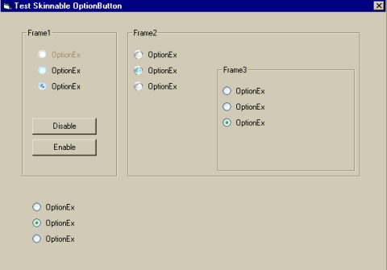



## OptionEx 1\.0

### Description

This is a Skinnable OptionButton. Works like the original OptionButton provided by MS. Fixed problem when setting all optionbuttons value to true in desing time. Now only one can have value set to true in design time.
 
### More Info
 
This is my first attempt at a usercontrol, so don't be to hard on me.

             |
---                |---
**Submitted On**   |2002-07-19 12:50:40
**By**             |[Pierre Wennerlund](https://github.com/Planet-Source-Code/PSCIndex/blob/master/ByAuthor/pierre-wennerlund.md)
**Level**          |Intermediate
**User Rating**    |4.6 (23 globes from 5 users)
**Compatibility**  |VB 6\.0
**Category**       |[Custom Controls/ Forms/  Menus](https://github.com/Planet-Source-Code/PSCIndex/blob/master/ByCategory/custom-controls-forms-menus__1-4.md)
**World**          |[Visual Basic](https://github.com/Planet-Source-Code/PSCIndex/blob/master/ByWorld/visual-basic.md)
**Archive File**   |[OptionEx\_11080637192002\.zip](https://github.com/Planet-Source-Code/pierre-wennerlund-optionex-1-0__1-37023/archive/master.zip)

